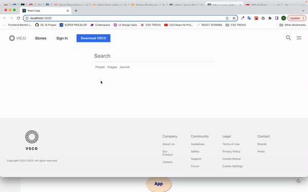

# VSCO-CLONE with Create React App

In this project, I made a clone of the popular photo application vsco.

## Live Link of the Project

[VSCO-CLONE](https://vsco-app-clone.netlify.app/)

Tools 🛠️

- React
- ContextAPI
- Styled Components

## Badges

## Demo 

()